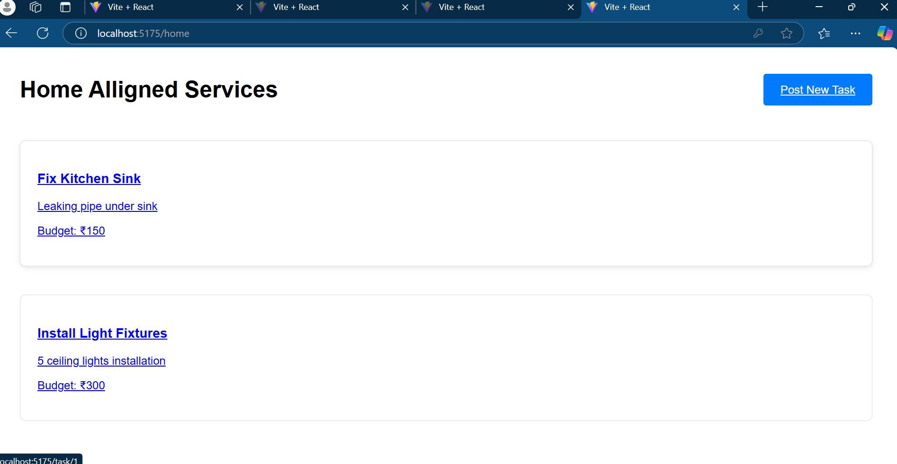
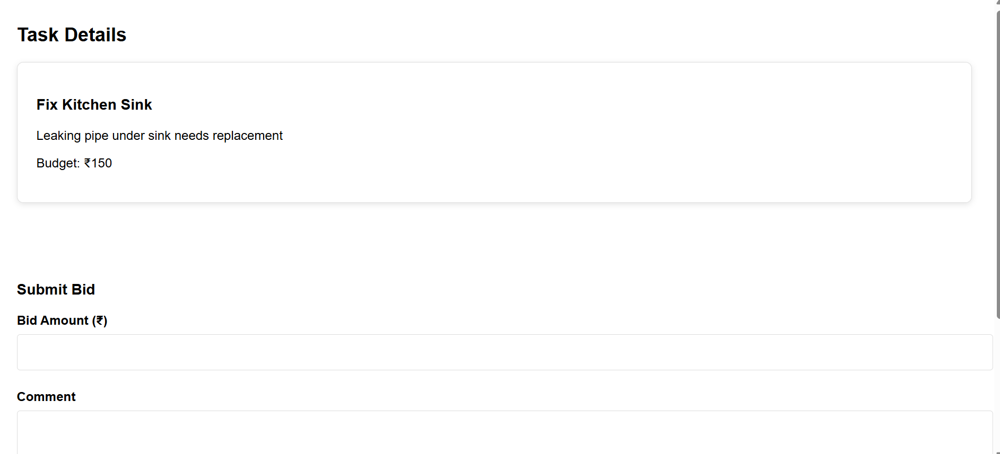

# Home Alligned Services 🏠

### Hosted Project Link
https://freelance-3gfe.vercel.app/

### Project Description
HomeAlligned Services is a comprehensive platform that connects homeowners with skilled service providers. Users can post home-related tasks, receive bids from qualified professionals, and manage service bookings through a secure and user-friendly interface.

### The Problem Statement
Finding reliable home service providers is often challenging and time-consuming. Homeowners struggle to:
- Find trustworthy professionals for home services
- Compare prices and service quality 
- Manage service bookings efficiently
- Make secure payments

### The Solution
HomeAlligned Services provides a streamlined platform where:
- Homeowners can easily post their service requirements
- Service providers can bid on available tasks
- Real-time bidding system ensures competitive pricing
- Secure payment integration with PayPal
- User-friendly interface for both homeowners and service providers

## Technical Details
### Technologies/Components Used
For Software:
- Languages: JavaScript, HTML, CSS
- Frontend Framework: React.js
- Styling: TailwindCSS
- Routing: React Router
- Payment Integration: PayPal React Components
- Authentication: JWT/Local Storage

### Implementation
#### Installation

Run
[commands]

Project Documentation
For Software:

Screenshots (Add at least 3)

### Project Demo
#### Video
https://drive.google.com/file/d/1Ex9JorruCyt8GL6joF9NsQaojlGPXN-u/view?usp=sharing

*Video demonstrates the complete workflow of posting a task, bidding, and payment process*

